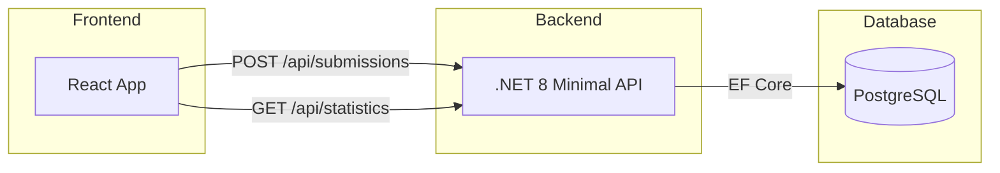
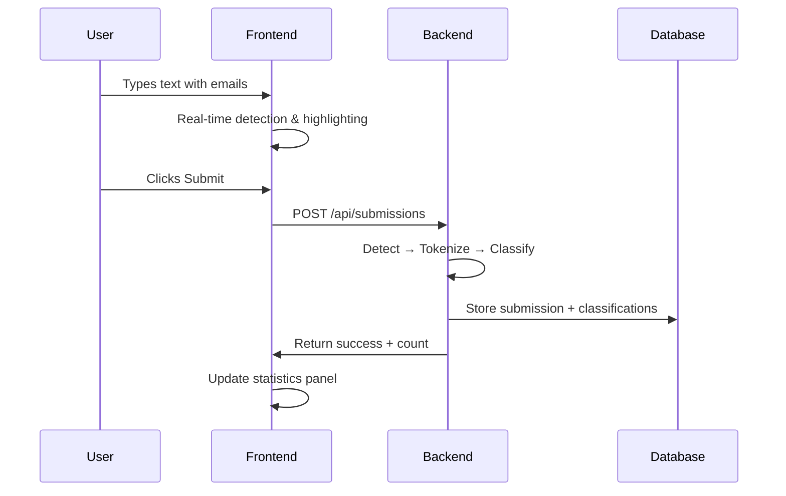
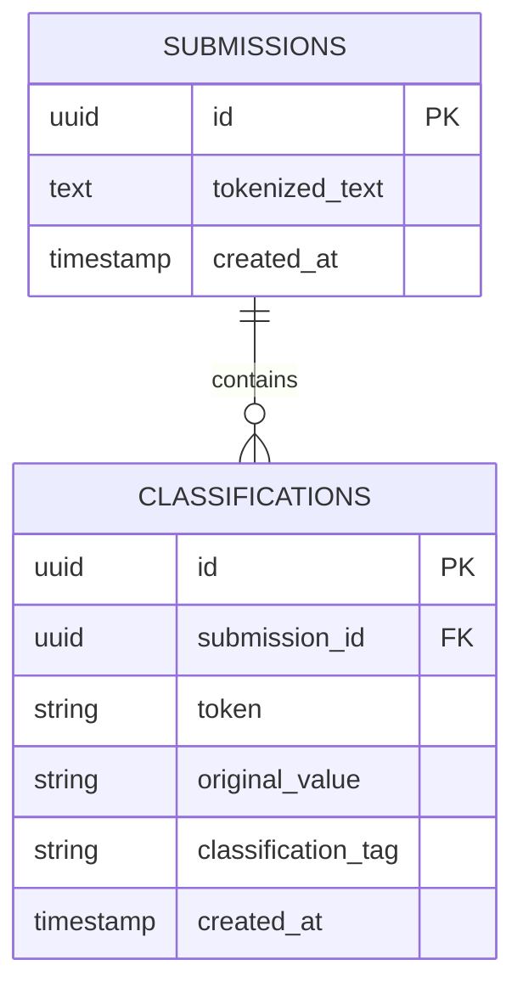
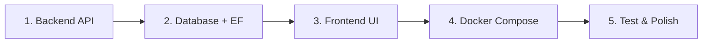

# QTip - Implementation Plan

## Approach

This document outlines my pragmatic approach to building QTip, mainly focused on delivering a working solution within the expected timeframe while demonstrating clean architecture decisions.

### Guiding Principles
- **Simplicity over abstraction:** No unnecessary layers or patterns
- **End-to-end first:** Get the full flow working, then polish
- **Clear separation:** Tokenized content separate from sensitive values

---

## Architecture Overview

### Technology Choices

| Layer | Choice | Rationale |
|-------|--------|-----------|
| Frontend | React + TypeScript | Type safety, fast iteration with Vite |
| Backend | .NET 8 Minimal APIs | Clean, low ceremony, good for small APIs |
| Database | PostgreSQL | Reliable, great Docker support |
| Deployment | Docker Compose | Single command startup as required |

---

## Core Flow

---

## Data Model

The schema separates **tokenized content** (safe for general use) from **sensitive values** (the classification vault).

**Example transformation:**

| Input | Tokenized Output |
|-------|------------------|
| `Contact john@test.com` | `Contact {{TKN-a1b2c3}}` |

The classification record stores: `token: TKN-a1b2c3`, `original_value: john@test.com`, `tag: pii.email`

---

## API Design

Two endpoints, I made them intentionally minimal:

| Endpoint | Purpose |
|----------|---------|
| `POST /api/submissions` | Accept text, detect/tokenize emails, persist, return count |
| `GET /api/statistics` | Return total PII email count across all submissions |

---

## Frontend Approach

The UI consists of three logical parts:

1. **Text Input:** Textarea with an overlay layer for visual highlighting
2. **Submit Button:** Triggers backend submission
3. **Statistics Panel:** Displays count from backend, updates after each submission

### Email Highlighting Strategy
- Use a transparent textarea over a styled div
- Detect emails on every keystroke using regex
- Render detected emails with underline styling in the background div
- Show tooltip on hover: "PII - Email Address"

---

## Implementation Order

1. **Backend:** Endpoints with hardcoded responses first, then real logic
2. **Database:** Add PostgreSQL, EF migrations
3. **Frontend:** Text input, highlighting, connect to API
4. **Docker:** Containerize all services
5. **Test:** Verify complete flow works

---

## Trade-offs & Decisions

| Decision | Reasoning |
|----------|-----------|
| No repository pattern | Direct EF context is good for this scope I believe |
| No separate service classes | Logic is simple enough to live in endpoint handlers |
| Single regex for email detection | Good enough for demonstration, will implement refinement if time permits |
| Overlay-based highlighting | Simpler than contenteditable, fewer edge cases |

---

## Optional Extension (If Time Permits)

The current design supports multiple classification types by:
- Adding more regex patterns to the detection logic
- Using different `classification_tag` values (examples: `pii.phone`, `finance.iban`)
- No schema changes required

This would be implemented as a configuration object, not a full plugin system.
